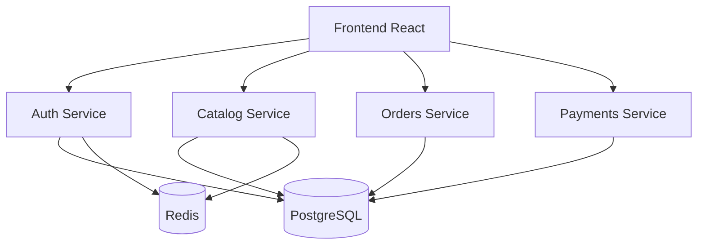

# Arquitectura inicial de microservicios

## Responsabilidades

- Auth Service administra el acceso y la identidad de usuarios.
- Catalog Service expone servicios, precios, promociones y membresías.
- Orders Service administra órdenes y sus estados.
- Payments Service registra pagos totales o parciales; no incluye pasarela electrónica.
- PostgreSQL almacena datos persistentes para la demostración DevOps.
- Redis se utiliza como caché y apoyo para sesiones temporales.

Esta arquitectura representa una base académica. La separación definitiva de bases de datos por servicio se evaluará en etapas posteriores.
